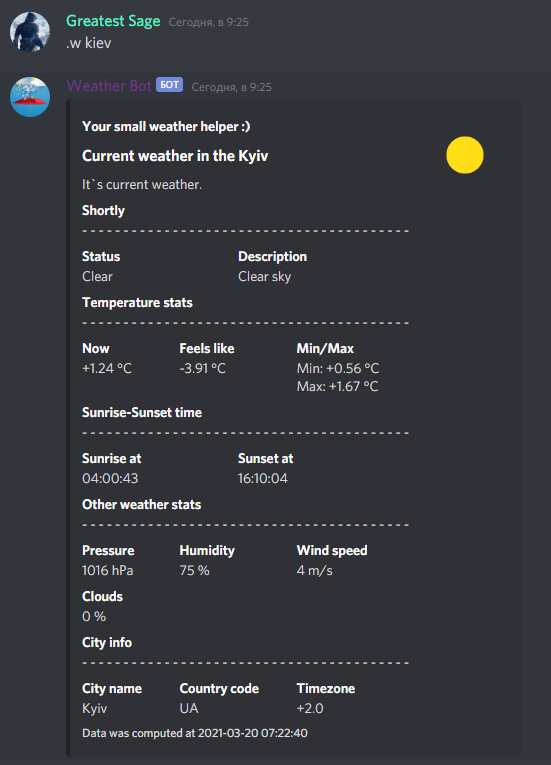

<!-- styles -->
<!-- <link href="sources/styles/style.css" rel="stylesheet"> -->

<!-- main -->
# It is a Discord Weather Bot!

### Weather Bot

It's your small weather helper in discord server!

### Easily you can get:

→ current weather;  
→ forecast for today and tomorrow;  
→ short (temp only) weather forecast for 5 days.

 

## Join bot to your server :)

## Some examples

