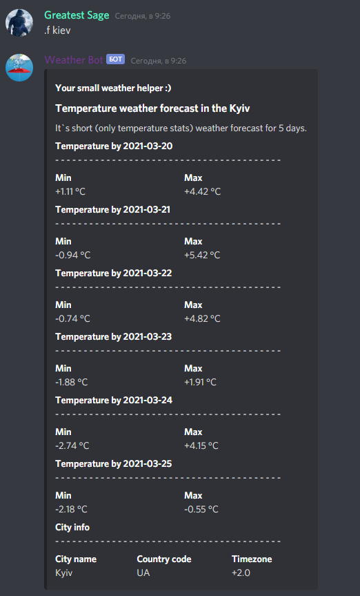

<!-- styles -->
<link href="sources/styles/style.css" rel="stylesheet">

<!-- main -->
# It is a Discord Weather Bot!

## Weather Bot

It's your small weather helper in discord server!

Easily you can get:

<ul>
	<li>current weather;</li>
	<li>detailed weather forecast for today and tomorrow;</li>
	<li>short (temp only) weather forecast for 5 days.</li>
</ul>

 

## Join bot to your server :)

## Some examples

